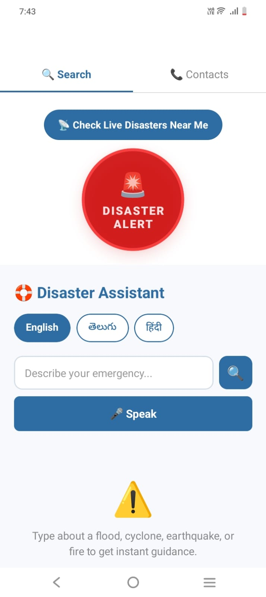
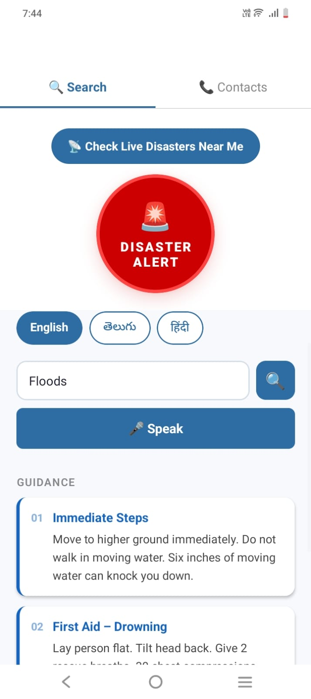
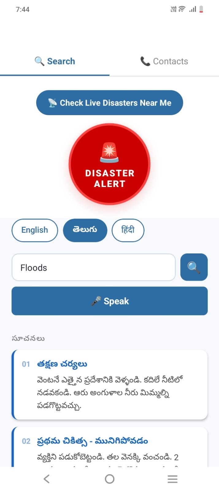
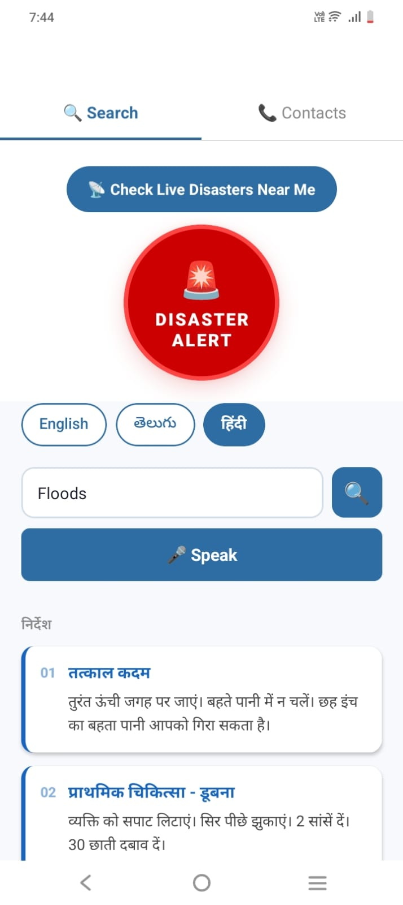
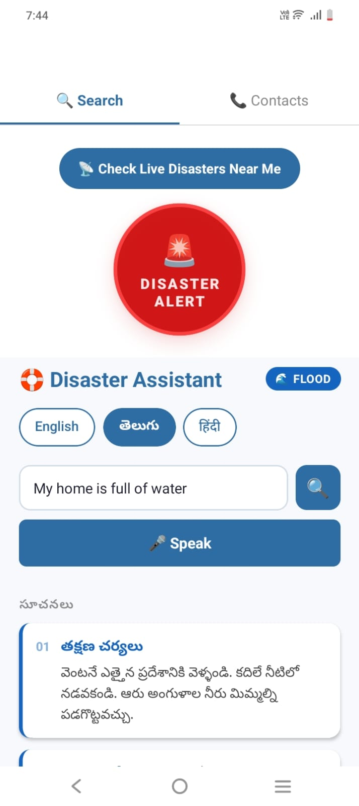
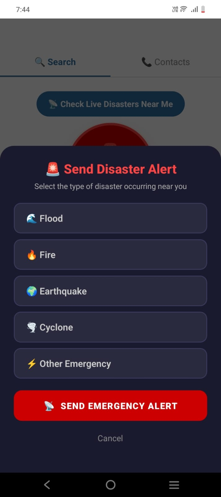
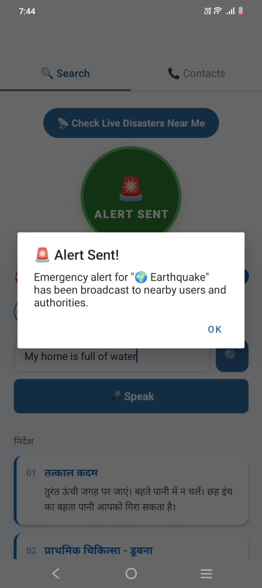
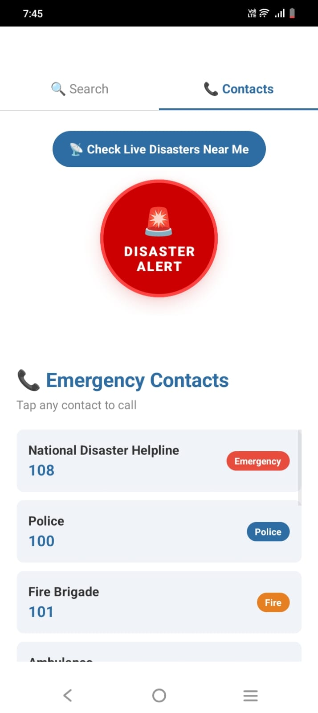

# 🛟 DisasterAI — On-Device Disaster Response App

> A React Native (Expo) app that gives instant disaster safety guidance using on-device speech recognition, text-to-speech, and keyword-based AI instruction engine — no internet required.

---

## 📱 What I Built

**DisasterAI** is a mobile app that helps people during natural disasters by providing:

- 🔍 **Smart Disaster Search** — type or speak keywords like "earthquake" or "my land is shaking" and instantly get step-by-step safety instructions
- 🎤 **Voice Input (Whisper)** — speak your situation, Whisper converts it to text on-device
- 🔊 **Text to Speech** — safety instructions are read aloud so you don't need to look at the screen
- 🚨 **One-tap Emergency Alert** — select disaster type and broadcast an alert instantly
- 📞 **Emergency Contacts** — quick access to critical contacts during a crisis

---

## 💡 Why It Matters

During disasters like floods, earthquakes, or cyclones:
- People **panic** and don't know what to do
- Internet connectivity is often **lost**
- People may be **injured** and can't read a screen

DisasterAI solves this by working **completely offline** — voice in, voice out, instant safety guidance.

---

## ⚙️ How It Works

```
User speaks or types → "earthquake" / "my land is shaking"
            │
            ▼
    Keyword matching engine
    detects disaster type
            │
            ▼
    Shows 5-6 step-by-step
    safety instructions
            │
            ▼
    Text-to-Speech reads
    instructions aloud
```

### Disaster Alert Flow
```
User taps 🚨 Alert button
            │
            ▼
    Selects disaster type
    (Flood / Fire / Earthquake
     / Cyclone / Other)
            │
            ▼
    Emergency alert broadcast
    + vibration feedback
```

---

## 🤖 How It Uses On-Device AI

| Feature | Technology | On-Device? |
|---------|-----------|------------|
| Voice Input | Whisper (speech-to-text) | ✅ Yes |
| Text to Speech | React Native TTS | ✅ Yes |
| Disaster Detection | Keyword matching engine | ✅ Yes |
| Emergency Alert | Custom alert system | ✅ Yes |

Everything runs **100% on-device** — no data sent to any server, no internet needed. Critical for disaster scenarios where connectivity fails.

---

## 🚀 How to Run It

> ⚠️ **Important:** DisasterAI is a development build — it is **not available on the Play Store or App Store**. You need to run it using the **Expo Go** app by following the steps below carefully.

---

### Step 1 — Install Prerequisites on Your Laptop

Make sure you have the following installed:

- **Node.js v18+** → Download from [https://nodejs.org](https://nodejs.org) (choose the LTS version)
- **Git** → Download from [https://git-scm.com](https://git-scm.com)
- **Expo CLI** → Install by running this in your terminal:

```bash
npm install -g expo-cli
```

To verify everything is installed, run:
```bash
node --version    # should show v18.x.x or higher
git --version     # should show a version number
```

---

### Step 2 — Install Expo Go on Your Phone

> ⚠️ **Expo Go is required** — the app runs through Expo Go, not as a standalone app.

1. Open the **Google Play Store** (Android) or **App Store** (iOS) on your phone
2. Search for **"Expo Go"**
3. Install it (it's free, by Expo)

**Direct links:**
- Android: [play.google.com/store/apps/details?id=host.exp.exponent](https://play.google.com/store/apps/details?id=host.exp.exponent)
- iOS: [apps.apple.com/app/expo-go/id982107779](https://apps.apple.com/app/expo-go/id982107779)

---

### Step 3 — Create an Expo Account (Same Account on Both Devices)

> ⚠️ **Critical:** You must use the **same Expo account** on your laptop and phone, otherwise the app won't appear.

1. Go to [https://expo.dev/signup](https://expo.dev/signup) and create a free account
2. On your **laptop**, log in via terminal:
```bash
npx expo login
```
Enter your email and password when prompted.

3. On your **phone**, open Expo Go → tap **"Log In"** → enter the same email and password

---

### Step 4 — Connect to the Same WiFi Network

> ⚠️ **Critical:** Your laptop and phone **must be on the same WiFi network**, otherwise the QR code won't work.

- Connect both your laptop and phone to the **same WiFi router**
- Do NOT use a mobile hotspot from your phone as the WiFi source

If you cannot use the same WiFi (e.g., in a college lab), skip to **Step 6 (Tunnel Mode)**.

---

### Step 5 — Clone and Run the Project

Open a terminal on your laptop and run these commands **one by one**:

```bash
# 1. Clone the repository
git clone https://github.com/maithripagidi3284-coder/DisasterAI.git

# 2. Go into the project folder
cd DisasterAI

# 3. Install all dependencies
npm install

# 4. Start the development server
npx expo start --clear
```

After a few seconds, a **QR code** will appear in the terminal.

---

### Step 6 — Scan the QR Code

**On Android:**
1. Open the **Expo Go** app on your phone
2. Tap **"Scan QR Code"**
3. Point your camera at the QR code in the terminal
4. The app will load on your phone in 30–60 seconds

**On iOS:**
1. Open your phone's default **Camera app**
2. Point it at the QR code
3. Tap the notification that appears at the top
4. Expo Go will open and load the app

---

### Step 7 — If You Get a Network Error ("Failed to download remote update")

This error means your phone cannot reach your laptop over WiFi. Fix it by using **tunnel mode**:

```bash
# Stop the current server first (press Ctrl+C), then run:
npx expo start --tunnel --clear
```

If tunnel is not installed, run this first:
```bash
npm install -g @expo/ngrok
npx expo start --tunnel --clear
```

A new QR code will appear — scan it again. Tunnel mode routes through the internet so network differences don't matter.

---

### Troubleshooting

| Problem | Fix |
|---|---|
| "Failed to download remote update" | Use `npx expo start --tunnel --clear` |
| QR code not scanning | Make sure Expo Go is installed and you're logged in |
| App crashes immediately | Run `npm install` again, then `npx expo start --clear` |
| "Something went wrong" screen | Tap "View error log" and share the error text |
| Server stopped / no QR code | Run `npx expo start --clear` again |
| Dependencies error | Run `rm -rf node_modules && npm install` |

---

## 📂 Project Structure

```
DisasterAI/
├── src/
│   ├── components/
│   │   ├── DisasterAlertButton.tsx   # 🚨 Emergency alert button
│   │   └── MicButton.tsx             # 🎤 Whisper voice input
│   ├── screens/
│   │   ├── HomeScreen.tsx            # 🔍 Search + safety instructions
│   │   └── ContactsScreen.tsx        # 📞 Emergency contacts
│   ├── services/                     # Speech & TTS service layer
│   ├── models/                       # Disaster keyword models
│   ├── store/                        # State management
│   └── data/                         # Local disaster instructions data
├── App.tsx                           # Root component + tab navigation
├── app.json                          # Expo config
└── package.json
```

---

## 🎥 Demo Video

## Demo Video

## Demo Video

[](https://youtube.com/shorts/qtqqQ8DdsZg)

---

## 📸 Screenshots

### App Screens
<p float="left">
  
  
  
  
  
</p>

### Alerts
<p float="left">
  
  
</p>

### Contacts


---

## 📄 License

This project is licensed under the **MIT License** — see [LICENSE](./LICENSE) file for details.

---

## 👩‍💻 Built By

**Maithri** — B.Tech Computer Science, CBIT Hyderabad  
Solo developer | Full-stack & AI developer
